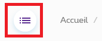
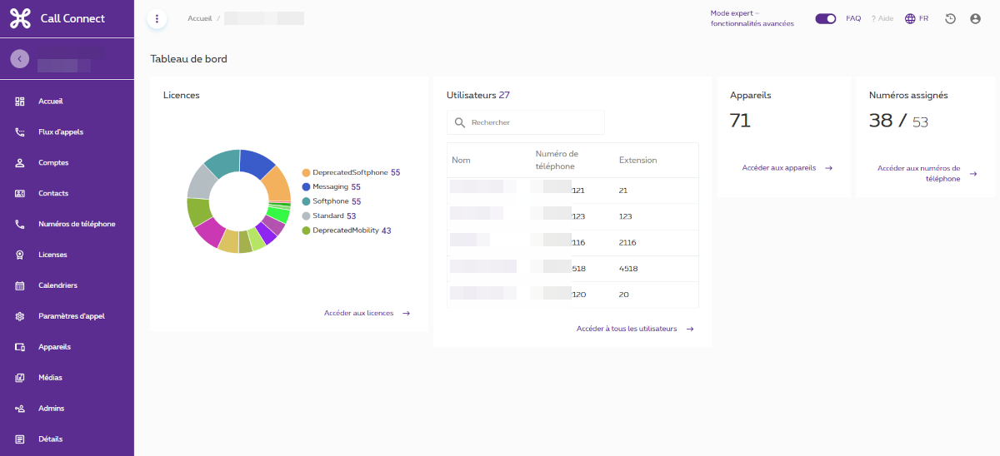

# La page d'accueil

{ align=left}

Avant d'aller plus loin je vous conseil de cliquer sur ce bouton en haut à gauche afin d'étendre le menu et avoir la description des icones

## Ce qu'on voit sur la page d'accueil

* A gauche le menu complet
* En haut Accueil / votre compte call connect - Le mode expert (que je vous conseil d'acitver si ce n'est pas le cas) - Lien vers la FAQ - Changer langue - Se déconnecter
* Licences : Le nombre de licences utilisée
* Une liste d'utilisateur
* Le nombre d'appereils installés
* Le nombre de numéros assignés

A chaque section un lien est présent pour accéder au détail.
