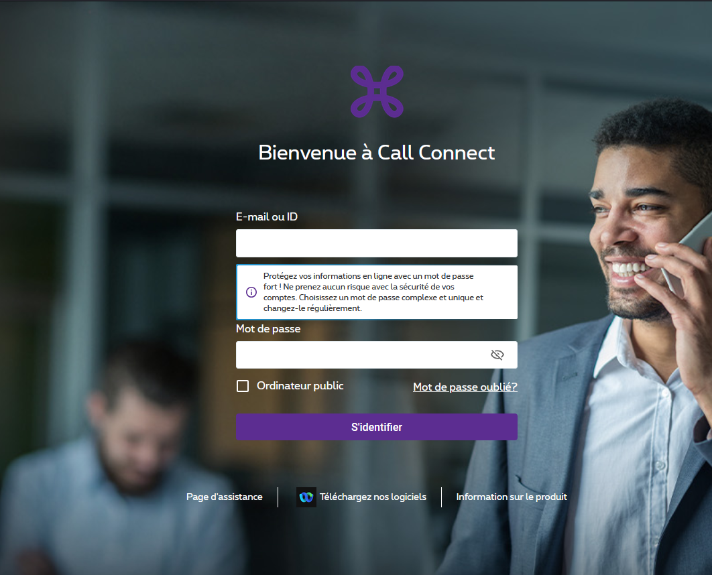

# La page de la plate-forme

Rendez-vous à l'adresse du site Call Connect [https://callconnect.proximus.be](https://callconnect.proximus.be).

## Rappel

La partie "Administrateur" modifie l'utilisation globale du Call Connect et peut modifier certains aspect des utilisateurs.

N'y allez pas si vous souhaitez juste ajouter des boutons de raccourci sur votre poste ou modifier vous répertoire, utilisez l'interface "Utilisateur" à la place.

:warning: Votre identifiant et mot de passe Administrateur vous ont été envoyé par mail avant le passage du technicien.

> Vous pouvez demander au technicien de créer un nouvel identifiant plus facile à retenir.

## Se connecter

Pour se connecter, veuillez entrer votre ID dans le champ E-mail ou ID et le mot de passe dans le champ Mot de passe puis cliquez sur "S'identifier".

Vous avez, également, la possibilité de réinitialiser le mot de passe en cliquet sur "Mot de passe oublié ?"
