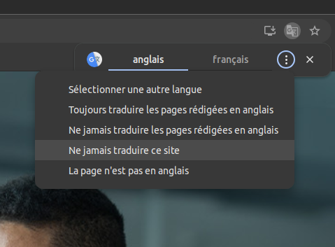

# Accueil

Bienvenue sur ce guide de la plate-forme Call Connect de Proximus !

Si vous souhaitez des informations sur ce produits, veuillez consulter cette page [Bizz Call Connect](https://www.proximus.be/fr/id_cb_call_connect/independants-et-petites-entreprises/telephonie-cloud-cybersecurite-marketing-digital/bizz-call-connect.html)

## But de ce guide

Ce guide a pour but de vous aider dans la gestion du portail Call Connect. En effet je remarque que beaucoup d'utilisateur ne l'utilise pas ou l'utilise mal.
Grâce à ce site, vous allez arriver à gérer vos appels, vos déviations, votre call center mais aussi le calendrier de fermeture et d'autres aspect pratique du produit.

## A qui s'adresse ce guide ?

Ce guide s'adresse aussi bien à l'utilisateur direct du Call Connect qu'à l'IT qui gère toute l'infrastructure de la téléphonie du client.

## De quoi avez-vous besoin ?

* D'un ordinateur ou d'une tablette, bien que la plate-forme soit accessible par smartphone, la petite taille de ce dernier est un frein à une bonne navigation sur le site.
* Vos identifiants, les identifiants administrateur vous ont été envoyé par mail avant la visite du technicien. Si vous ne les avez pas vous pouvez appeler le 0800/33.500 pour vous aider à les créer ou demander au technicien de les créer lors de sa visite.

## Informations utiles

{ aligne=left }

* Si vous utilisez Google Chrome il se peut que, lorsque vous arrivez sur le site, vous ayez une page blanche. C'est un bug causé par le traducteur automatique de Chrome. Il faut le désactiver pour la plate-forme Call Connect.

* Voici l'adresse du site Call Connect [https://callconnect.proximus.be](https://callconnect.proximus.be).

* Si vous avez le moindre soucis avec le produit n'hésitez pas à contacter le 0800/33.500, nos experts sont à votre service.
